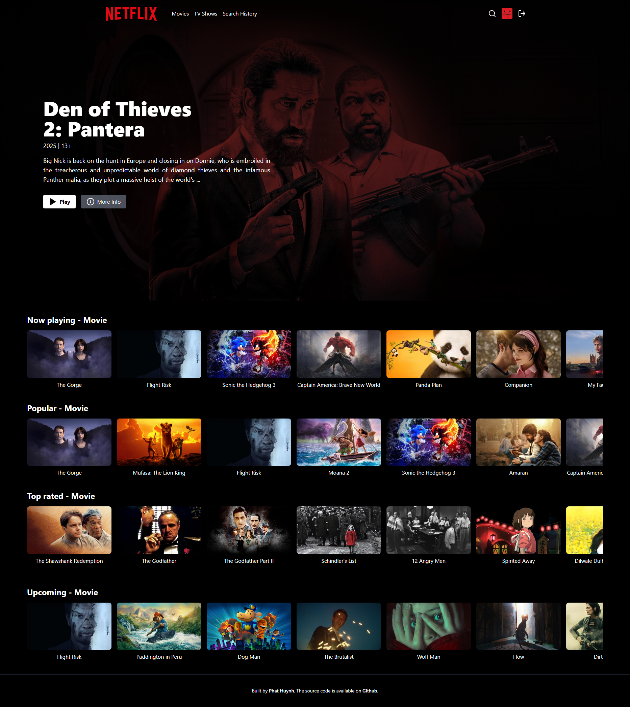
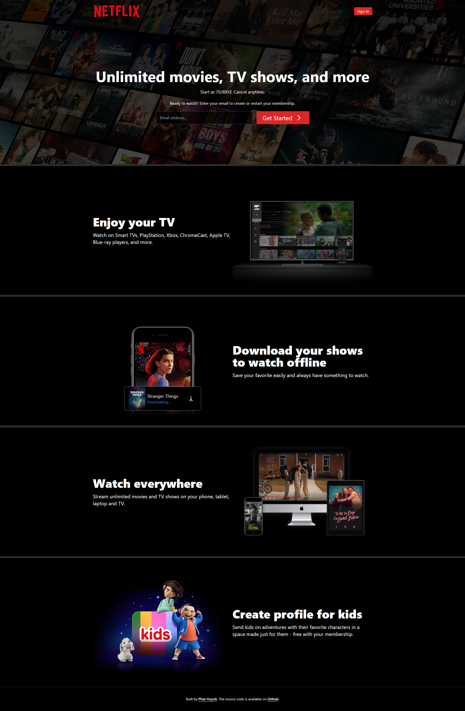
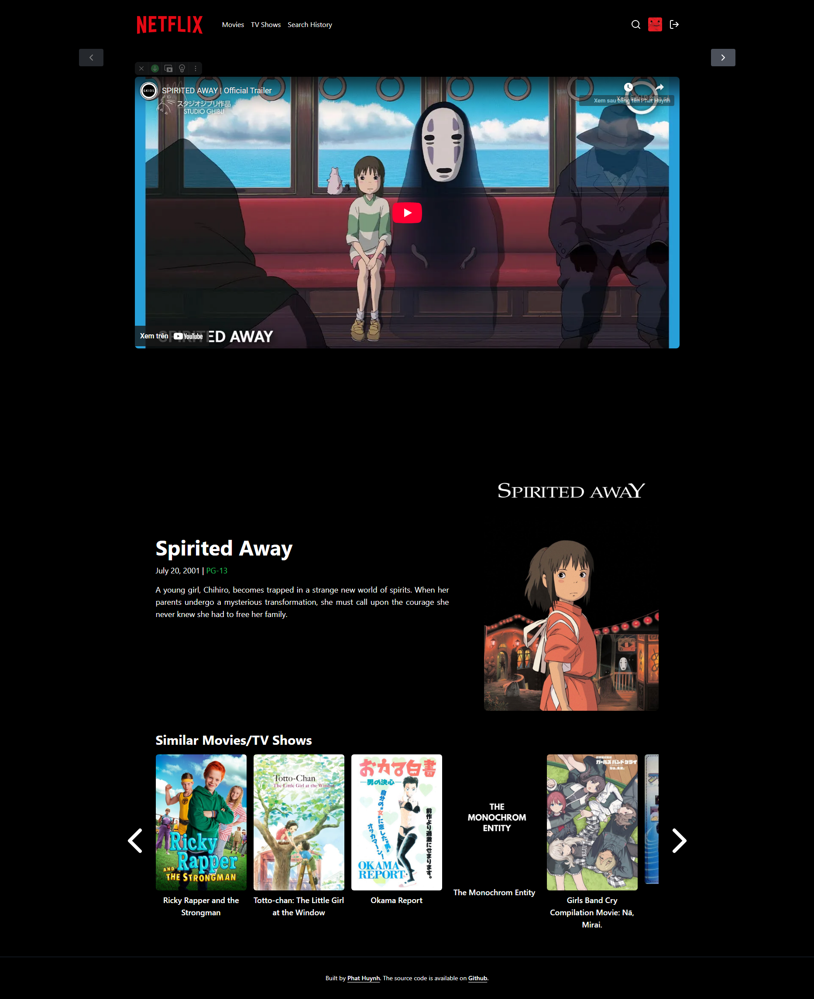
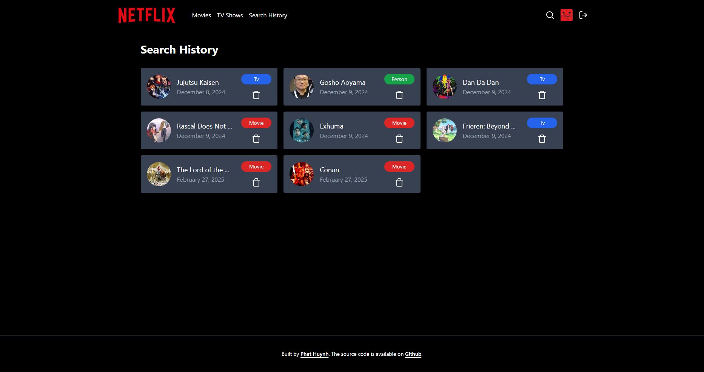

<h1 align="center">Netflix Clone With TMDB 🎬</h1>

# [Live Demo](https://netflix-clone-7y9r.onrender.com/)

## Features

- User Authentication: Sign up, login with email (protected by JWT).
- Movie Catalog: Display now playing, trending, popular, and top-rated movies.
- Search Functionality: Find movies, TV shows, Actors/Directors and previously searched results.
- Movie Details Page: Show trailers, movie descriptions, ratings and related content.
- Responsive Design: Optimized for both desktop and mobile devices.

- [TMDB](https://www.themoviedb.org/): Provides an API to fetch movie, TV show, actor, and trailer data.
- [React](https://reactjs.org/): Used to build user interfaces for websites.
- [Vite](https://vite.dev/guide/): A fast build tool that optimizes performance for React applications.
- [Zustand](https://zustand-demo.pmnd.rs/): A simple, lightweight, and easy-to-use state management alternative to Redux.
- [Axios](https://axios-http.com/docs/intro): Used to make API requests between the frontend and backend, helping to retrieve and send data.
- [TailwindCSS](https://tailwindcss.com): Build the interface just by declaring the class in the HTML file, create skeleton very quickly.
- [Node.js](https://nodejs.org/docs/latest/api/): Process requests from users and manage data efficiently.
- [Express.js](https://expressjs.com/): Builds a backend API to handle functions such as user authentication, product management, cart and orders.
- [MongoDB](https://www.mongodb.com/): Stores website data.
- [JSON Web Token](hhttps://www.npmjs.com/package/jsonwebtoken): Authenticate and manage user access rights, ensuring security when logging in and using the system.

### Preview

